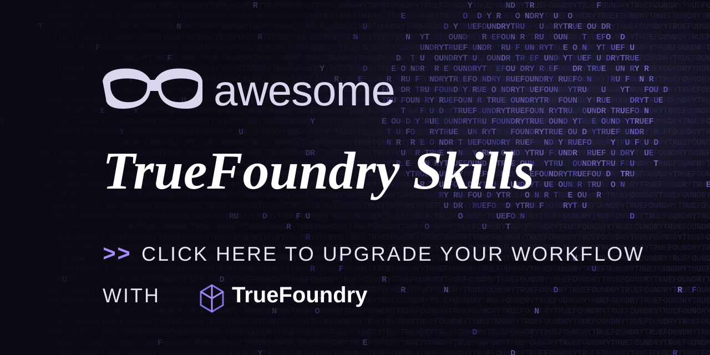
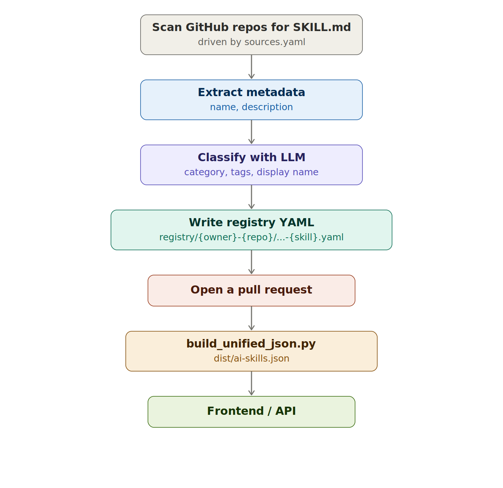

<h1 align="center">TrueFoundry Skills Registry</h1>



<p align="center">
  <a href="https://awesome.re"></a>
  <a href="CONTRIBUTING.md"></a>
  <a href="#license"></a>
</p>

<p align="center">
  <!-- skills-count-start -->
  
  <!-- skills-count-end -->
  
  
</p>

<p align="center">
  <a href="https://x.com/truefoundry"></a>
  <a href="https://www.linkedin.com/company/truefoundry"></a>
  <a href="https://discord.gg/truefoundry"></a>
</p>

<p align="center">
  Works across
  <b>Cursor</b> · <b>Windsurf</b> · <b>Cline</b> · <b>Aider</b> · <b>Zed</b> · <b>Continue</b> · <b>Copilot</b> · <b>Kiro</b> · <b>Roo Code</b> · <b>Lovable</b>
  — and anything else that understands <code>SKILL.md</code>.
</p>

---

## Contents

- [What Are Agent Skills?](#what-are-agent-skills)
- [Why a Registry?](#why-a-registry)
- [Browse by Category](#browse-by-category)
- [Categories](#categories)
- [How the Registry Works](#how-the-registry-works)
- [Getting Started](#getting-started)
- [Using the Catalog](#using-the-catalog)
- [Creating Skills](#creating-skills)
- [Configuring Sources](#configuring-sources)
- [Registry Entry Format](#registry-entry-format)
- [Contributing](#contributing)
- [Resources](#resources)
- [License](#license)

## What Are Agent Skills?

Agent skills are **reusable instruction packages** that teach an AI agent how to
handle a specific class of tasks. Each skill is a folder containing a `SKILL.md`
file with YAML frontmatter (name, description) and Markdown instructions,
optionally bundled with scripts, references, and assets.

Skills load progressively. At session start, an agent sees only each skill's name
and description — roughly 100 tokens per skill. The full `SKILL.md` body loads
only when the agent decides the skill is relevant to the current task, and
auxiliary files under `scripts/` and `references/` load on demand. This is what
lets a single agent host hundreds of skills without bloating its context window.

Skills are not MCP servers and not tools. MCP defines how an agent *connects* to
external systems; tools are the individual functions an agent *invokes*; skills
define the *workflow* — what to do, in what order, with what guardrails — once
the connections and tools are in place.

## Why a Registry?

Skills are scattered across hundreds of GitHub repos. This project pulls them
into **one curated, machine-readable catalog** so agents and humans can discover
them in a single place.

It's an **automated index**, not a hand-maintained list. A pipeline scans the
repos configured in [`sources.yaml`](sources.yaml) for `SKILL.md` files, extracts
metadata, classifies every skill into a category and tags with an LLM, and
publishes a unified export at [`dist/ai-skills.json`](dist/ai-skills.json). Add a
source once and its skills flow into the catalog automatically.

<p align="center">
  <b>1023 skills</b> · <b>91 official</b> · <b>71 source repositories</b>
</p>

## Browse by Category

Every skill is classified into exactly one category plus freeform discovery tags.

| Category | Skills | What's inside |
|----------|-------:|---------------|
| [Marketing](#marketing) | 248 | Growth, SEO, ads, content, branding, outreach |
| [Coding](#coding) | 208 | Dev workflows, testing, code review, infra, tooling |
| [Productivity](#productivity) | 138 | Files, tasks, notes, personal and team workflows |
| [Science](#science) | 129 | Research, simulation, scientific computing, analysis |
| [Design](#design) | 67 | UI/UX, visual identity, brand systems, layout |
| [Data & AI](#data--ai) | 66 | Data analysis, ML, agents, observability, pipelines |
| [Creative](#creative) | 58 | Images, video, audio, generative and creative work |
| [Business](#business) | 46 | Strategy, finance, operations, product management |
| [Legal](#legal) | 30 | Contracts, compliance, privilege, legal review |
| [Health](#health) | 22 | Health, wellbeing, and care workflows |
| [Miscellaneous](#miscellaneous) | 11 | Everything that doesn't fit a single bucket |

> Counts reflect the current catalog and update as new sources are scanned.
> The full machine-readable list lives in [`dist/ai-skills.json`](dist/ai-skills.json),
> sorted so the most-starred source repos lead.

## Categories

Jump to a category to browse its skills. Skill listings are coming soon — for now
the full set lives in [`dist/ai-skills.json`](dist/ai-skills.json).

### Marketing

248 skills — growth, SEO, ads, content, branding, and outreach.

### Coding

208 skills — dev workflows, testing, code review, infra, and tooling.

### Productivity

138 skills — files, tasks, notes, and personal or team workflows.

### Science

129 skills — research, simulation, scientific computing, and analysis.

### Design

67 skills — UI/UX, visual identity, brand systems, and layout.

### Data & AI

66 skills — data analysis, ML, agents, observability, and pipelines.

### Creative

58 skills — images, video, audio, and generative or creative work.

### Business

46 skills — strategy, finance, operations, and product management.

### Legal

30 skills — contracts, compliance, privilege, and legal review.

### Health

22 skills — health, wellbeing, and care workflows.

### Miscellaneous

11 skills — everything that doesn't fit a single bucket.

[↑ Back to categories](#browse-by-category)

## How the Registry Works



1. **Configure sources** in [`sources.yaml`](sources.yaml) — GitHub repo URLs and
   optional scan paths.
2. **A weekly pipeline** (Sunday 00:00 UTC) or a manual dispatch runs
   [`scripts/update.py`](scripts/update.py).
3. The scanner walks each source for `SKILL.md` files, extracts metadata, and
   **classifies** each skill via the TrueFoundry AI Gateway.
4. Each skill is written into a per-source folder (`registry/{owner}-{repo}/`),
   and a **pull request** is opened for human review.
5. On merge to `main`, [`scripts/build_unified_json.py`](scripts/build_unified_json.py)
   collects everything into [`dist/ai-skills.json`](dist/ai-skills.json) for the
   frontend and downstream consumers.

## Getting Started

### Use a skill in your agent

Most agents read skills from a local directory. For example, with Claude Code:

```bash
mkdir -p ~/.config/claude-code/skills/
cp -r skill-name ~/.config/claude-code/skills/
head ~/.config/claude-code/skills/skill-name/SKILL.md
```

The agent loads the skill automatically and activates it when relevant. Cursor,
Windsurf, Cline, Codex, Gemini CLI, and other agents follow the same open
`SKILL.md` convention — drop the folder where your agent expects skills.

### Find skills programmatically

The catalog is a single JSON file you can fetch and filter:

```bash
# Top coding skills in the catalog
jq '[.[] | select(.category == "coding")][:10] | .[].display_name' dist/ai-skills.json
```

## Using the Catalog

[`dist/ai-skills.json`](dist/ai-skills.json) is the canonical export. Each entry
carries the skill's `id`, `display_name`, `description`, `authors`, `tags`,
`category`, `source` (repo + path), `metadata.stars`, and `added_at`. Entries are
ordered by source-repo stars (descending) so the most popular sources lead and
each source's skills stay grouped together — ideal for powering a search UI, an
agent's skill picker, or a recommendations API.

## Creating Skills

Each skill is a folder with a `SKILL.md` file and optional supporting files:

```
skill-name/
├── SKILL.md          # Required: instructions + YAML frontmatter
├── scripts/          # Optional: helper scripts
├── references/       # Optional: reference docs
└── assets/           # Optional: templates / assets
```

Minimal template:

```markdown
---
name: my-skill-name
description: A clear description of what this skill does and when to use it.
---

# My Skill Name

Detailed description of the skill's purpose and capabilities.

## When to Use This Skill

- Use case 1
- Use case 2

## Instructions

[Detailed instructions for the agent on how to execute this skill]

## Examples

[Real-world examples showing the skill in action]
```

**Best practices:** focus on specific, repeatable tasks; write instructions for
the agent, not the end user; include clear examples and edge cases; confirm
before destructive operations; and document prerequisites. The full guide,
including a richer template, lives in [`CONTRIBUTING.md`](CONTRIBUTING.md).

## Configuring Sources

Edit [`sources.yaml`](sources.yaml) to add or remove the repos that get scanned.

**Multi-skill repo** — each subdirectory with a `SKILL.md` becomes its own entry:

```yaml
sources:
  - url: https://github.com/garrytan/gbrain
    skills_path: skills/
```

**Multiple scan roots** with no shared parent — use `skills_paths`:

```yaml
sources:
  - url: https://github.com/huggingface/skills
    skills_paths:
      - skills/
      - hf-mcp/skills/
```

**Whole-repo skill** — omit `skills_path` (defaults to `"/"`, i.e. `SKILL.md` at
the repo root):

```yaml
sources:
  - url: https://github.com/jane/pr-reviewer
```

Add `is_official: true` for first-party/vendor repos. Awesome-list repos (curated
link directories with no `SKILL.md` files) are not scannable and are kept
commented out as future discovery sources.

## Registry Entry Format

Each skill is generated as `registry/{owner}-{repo}/{owner}-{repo}-{skill-dir}.yaml`:

```yaml
id: anthropics-skills-algorithmic-art
display_name: Algorithmic Art
description: Creating algorithmic art using p5.js with seeded randomness ...
authors:
  - anthropics
is_official: true
tags:
  - generative-art
  - p5js
  - creative-coding
category: creative
source:
  path: /skills/algorithmic-art
  repo: anthropics/skills
metadata:
  stars: 149805
added_at: "2026-06-05"
```

- **Filename** `{owner}-{repo}-{skill_dir}.yaml` is globally unique; it's also the
  dedupe key, so a skill is "known" if that stem exists in any folder.
- **One folder per source repo** keeps every source's skills together.
- **`metadata.stars`** records the source repo's GitHub star count and drives the
  ordering of `dist/ai-skills.json`.

## Contributing

Contributing is simple: **add a GitHub repo link to
[`sources.yaml`](sources.yaml)** and open a PR. A GitHub Action scans the repo for
`SKILL.md` files and adds them to the catalog automatically.

- Found a repo with skills? Add its URL.
- Wrote your own skill? Push the `SKILL.md` to a public repo and add that URL.

See [`CONTRIBUTING.md`](CONTRIBUTING.md) for the details.

## Resources

- [Anthropic Skills Repository](https://github.com/anthropics/skills) — the open `SKILL.md` standard and example skills
- [Agent Skills (engineering deep dive)](https://www.anthropic.com/engineering/equipping-agents-for-the-real-world-with-agent-skills)
- [Skills Overview](https://www.anthropic.com/news/skills)
- [`sources.yaml`](sources.yaml) · [`scripts/`](scripts/) · [`dist/ai-skills.json`](dist/ai-skills.json)

## License

This repository's tooling is maintained by TrueFoundry and licensed under the
**Apache License 2.0**. Individual skills remain under the licenses of their
**source repositories** — always check the original repo (linked via each entry's
`source.repo`) before using a skill.

---

<p align="center">
  Built by <a href="https://truefoundry.com">TrueFoundry</a> · Skills are portable across agents — write once, use everywhere.
</p>
